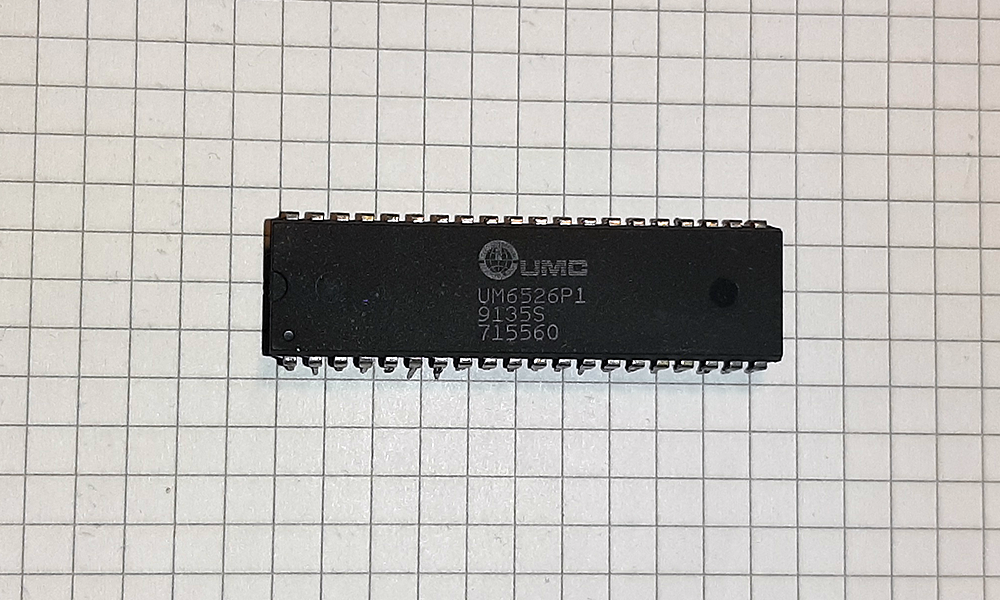
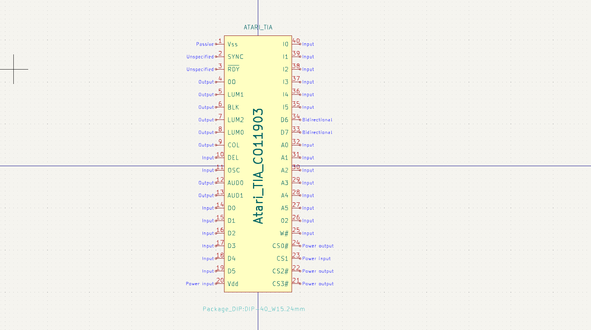

# CO10444

## General
- Atari 2600

Other names: UM6526, UM6532, VF4013, CO11903, E4002

## Channels
On each of two channels AUD0/1, you can choose:

- **Waveform**: 50% or 58% pulse wave, 4 other waves, or white noise.
- **Pitch**: Range dependent on waveform.
- **Volume** from 0 to 15.

The TIA can produce PCM music, but it takes a lot of RAM (while Atari 2600 doesn't have much), usually forcing developers to use it with static images or completely black screen. It seems there weren't any official games to ever utilize the PCM music or speech.

Each oscillator has a 5-bit frequency divider and a 4-bit audio control register which manipulates the waveform. There is also a 4-bit volume control register per channel.

### Frequency Divider (AUDF0/1)
Frequencies are generated by taking 30 kHz and dividing by the 5-bit value supplied. The result is a cheap frequency divider capable of detuned notes and the odd tuned frequency. The TIA is not a musical chip unless the composer works within the frequency limits or modulates between two detuned frequencies to create a vibrato tuned note.

### Audio Control (AUDC0/1)
The Audio Control register generates and manipulates a pulse wave to create complex pulses or noise. The following table (with designed duplicates) explains how its tones are generated:

| HEX | D7 | D6 | D5 | D4 | D3 | D2 | D1 | D0 | Type of noise or division |
|-----|----|----|----|----|----|----|----|----|---------------------------|
| 0   |    |    |    |    | 0  | 0  | 0  | 0  | Set to 1 (volume only)    |
| 1   |    |    |    |    | 0  | 0  | 0  | 1  | 4 bit poly                |
| 2   |    |    |    |    | 0  | 0  | 1  | 0  | div 15 → 4 bit poly       |
| 3   |    |    |    |    | 0  | 0  | 1  | 1  | 5 bit poly → 4 bit poly   |
| 4   |    |    |    |    | 0  | 1  | 0  | 0  | div 2                     |
| 5   |    |    |    |    | 0  | 1  | 0  | 1  | div 2                     |
| 6   |    |    |    |    | 0  | 1  | 1  | 0  | div 31                    |
| 7   |    |    |    |    | 0  | 1  | 1  | 1  | 5 bit poly → div 2        |
| 8   |    |    |    |    | 1  | 0  | 0  | 0  | 9-bit poly (white noise)  |
| 9   |    |    |    |    | 1  | 0  | 0  | 1  | 5-bit poly                |
| A   |    |    |    |    | 1  | 0  | 1  | 0  | div 31                    |
| B   |    |    |    |    | 1  | 0  | 1  | 1  | Set last 4 bits to 1      |
| C   |    |    |    |    | 1  | 1  | 0  | 0  | div 6                     |
| D   |    |    |    |    | 1  | 1  | 0  | 1  | div 6                     |
| E   |    |    |    |    | 1  | 1  | 1  | 0  | div 93                    |
| F   |    |    |    |    | 1  | 1  | 1  | 1  | 5-bit poly div 6          |

## Links/Sources
- [TIA at VGMPF](http://www.vgmpf.com/Wiki/index.php?title=Television_Interface_Adaptor)
- [IC pictures and infos, shows also Fake ICs](https://www.ataricompendium.com/faq/vcs_tia/vcs_tia.html)
- [Wikipedia](https://en.wikipedia.org/wiki/Television_Interface_Adaptor)
