# 8 Bit Sound Chips
This is my personal collection of 8 Bit sound chips. I put some information together like datasheets etc., maybe it's useful for someone.

## KiCAD 7.x Symbols
[8_bit_soundchips.kicad_sym](8_bit_soundchips.kicad_sym) contains some KiCAD symbols you can use for your own circuits.

## Chips

### [AY-3-8910](AY-3-8910)

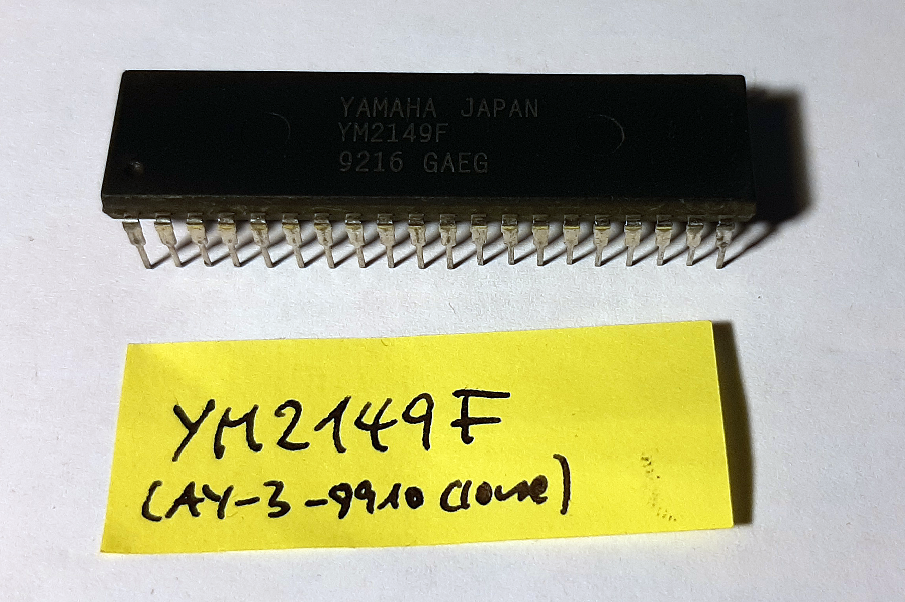

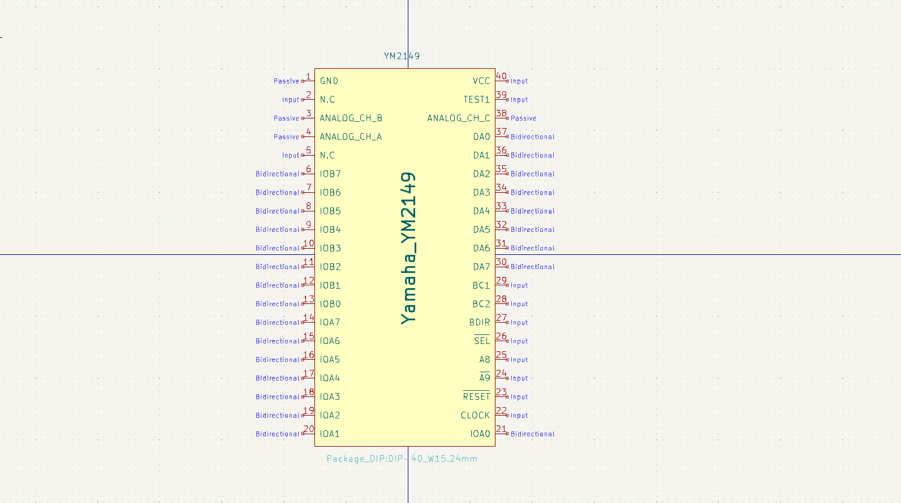

#### General

- Vectrex
- Amstrad CPC
- ZX Spectrum

Other versions: YM2149 (used in Atari ST)

Differences between AY and YM are listed [here](https://maidavale.org/blog/ay-ym-differences/)

DIP-40

#### Channels

The noise does not have its own channel, but is optionally mixed into any combination of square wave channels. Consequently, all noises share the same pitch, and each noise shares the volume of the square wave it accompanies or replaces. Some arrangers have mixed short noise drums over a square wave bass.

On each of channels A, B and C, you can choose:

- Whether a square wave plays.
- Whether the single white noise plays.
- Square wave pitch from 1 to 4095. The highest possible frequency is the sound chip's clock frequency divided by 16. Further divided by 4095, it equals the minimum frequency.
- Volume, either from 0 to 15, or fed by the single envelope generator.

On the whole chip, you can choose:

- **Noise pitch** from 1 to 31.
- **Envelope**. You can enable attack (volume up from 0 to 15) and/or decay (volume down from 15 to 0), at the end optionally reversed and/or looped. However, you can only choose one speed for both, and all channels get the same envelope. Due to those limits, many people generated envelopes themselves in software and set all three volumes manually.

Changing a volume produces a click; the greater the change, the louder. This allows to play unsigned 4-bit PCM samples. Changing all three volumes even allows 8-bit on mono. On stereo, 8-bit samples hiss loudly.

#### Links/Sources
- [AY-3-8910 at VGMPF](http://www.vgmpf.com/Wiki/index.php/AY-3-8910)
- [Wikipedia](https://en.wikipedia.org/wiki/General_Instrument_AY-3-8910)

### [CO10444 (TIA)](CO10444_TIA)

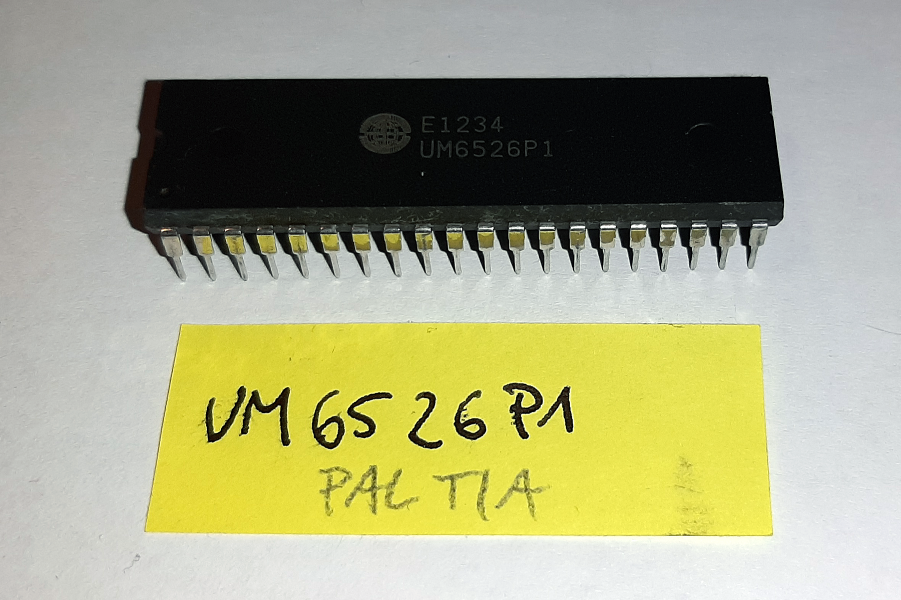

#### General
- Atari 2600

Other names: UM6526, UM6532, VF4013, CO11903, E4002

#### Channels
On each of two channels AUD0/1, you can choose:

- **Waveform**: 50% or 58% pulse wave, 4 other waves, or white noise.
- **Pitch**: Range dependent on waveform.
- **Volume** from 0 to 15.

The TIA can produce PCM music, but it takes a lot of RAM (while Atari 2600 doesn't have much), usually forcing developers to use it with static images or completely black screen. It seems there weren't any official games to ever utilize the PCM music or speech.

Each oscillator has a 5-bit frequency divider and a 4-bit audio control register which manipulates the waveform. There is also a 4-bit volume control register per channel.

##### Frequency Divider (AUDF0/1)
Frequencies are generated by taking 30 kHz and dividing by the 5-bit value supplied. The result is a cheap frequency divider capable of detuned notes and the odd tuned frequency. The TIA is not a musical chip unless the composer works within the frequency limits or modulates between two detuned frequencies to create a vibrato tuned note.

##### Audio Control (AUDC0/1)
The Audio Control register generates and manipulates a pulse wave to create complex pulses or noise. The following table (with designed duplicates) explains how its tones are generated:

| HEX | D7 | D6 | D5 | D4 | D3 | D2 | D1 | D0 | Type of noise or division |
|-----|----|----|----|----|----|----|----|----|---------------------------|
| 0   |    |    |    |    | 0  | 0  | 0  | 0  | Set to 1 (volume only)    |
| 1   |    |    |    |    | 0  | 0  | 0  | 1  | 4 bit poly                |
| 2   |    |    |    |    | 0  | 0  | 1  | 0  | div 15 → 4 bit poly       |
| 3   |    |    |    |    | 0  | 0  | 1  | 1  | 5 bit poly → 4 bit poly   |
| 4   |    |    |    |    | 0  | 1  | 0  | 0  | div 2                     |
| 5   |    |    |    |    | 0  | 1  | 0  | 1  | div 2                     |
| 6   |    |    |    |    | 0  | 1  | 1  | 0  | div 31                    |
| 7   |    |    |    |    | 0  | 1  | 1  | 1  | 5 bit poly → div 2        |
| 8   |    |    |    |    | 1  | 0  | 0  | 0  | 9-bit poly (white noise)  |
| 9   |    |    |    |    | 1  | 0  | 0  | 1  | 5-bit poly                |
| A   |    |    |    |    | 1  | 0  | 1  | 0  | div 31                    |
| B   |    |    |    |    | 1  | 0  | 1  | 1  | Set last 4 bits to 1      |
| C   |    |    |    |    | 1  | 1  | 0  | 0  | div 6                     |
| D   |    |    |    |    | 1  | 1  | 0  | 1  | div 6                     |
| E   |    |    |    |    | 1  | 1  | 1  | 0  | div 93                    |
| F   |    |    |    |    | 1  | 1  | 1  | 1  | 5-bit poly div 6          |

#### Links/Sources
- [TIA at VGMPF](http://www.vgmpf.com/Wiki/index.php?title=Television_Interface_Adaptor)
- [Wikipedia](https://en.wikipedia.org/wiki/Television_Interface_Adaptor)

### [CO12294 (POKEY)](CO12294_POKEY)

	

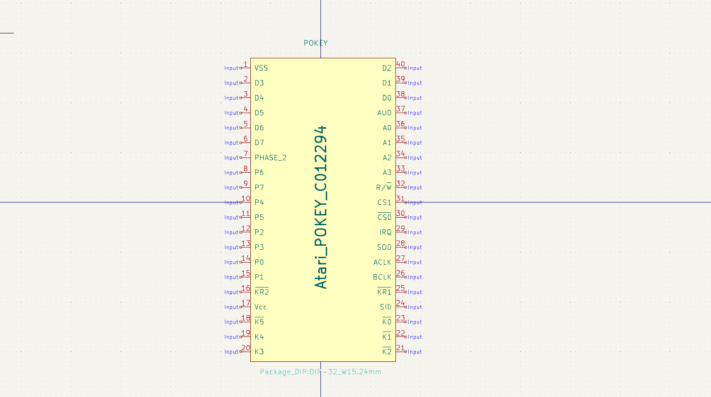

#### General
- Atari 400/800
- Atari XL/XE
- later Atari 5200
- Atari 7800 game cartridges (Ballblazer and Commando)
- Atari arcade systems

#### Links/Sources
- [Wikipedia](https://en.wikipedia.org/wiki/POKEY)

### [MOS 6560 (VIC)](MOS6560_VIC)

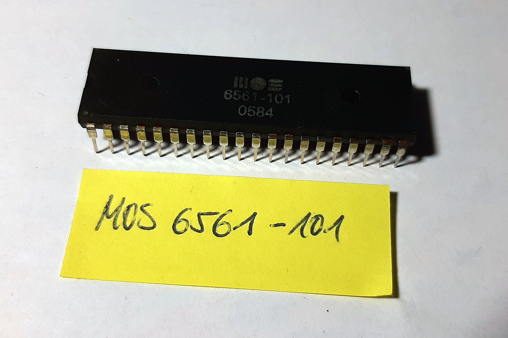	

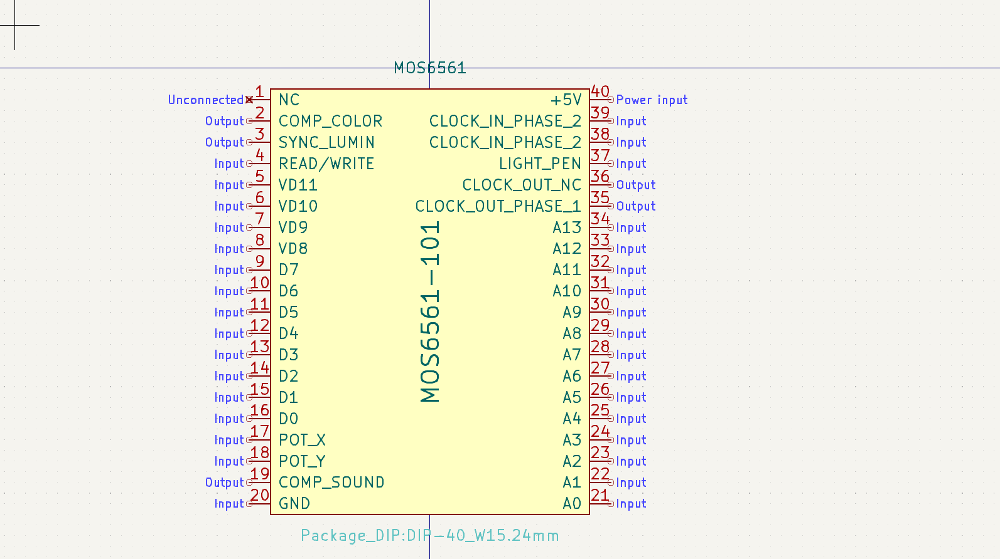

#### General
- Commodore VC20

Other names: MOS6561-101

#### Links/Source
- [Wikipedia](https://en.wikipedia.org/wiki/MOS_Technology_VIC)

### [MOS 6581 (SID)](MOS6581_SID)

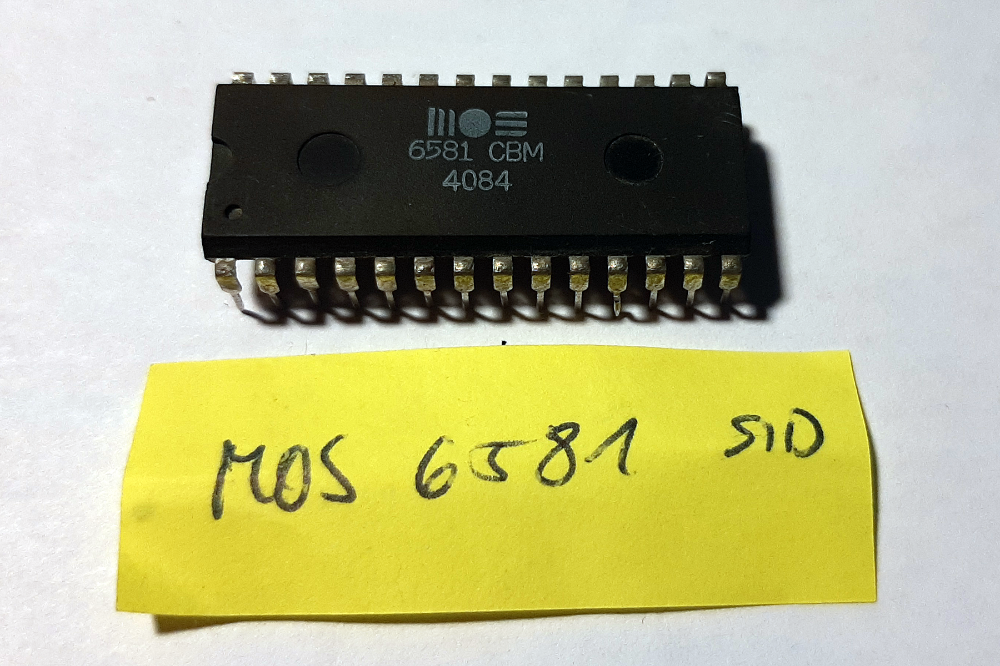

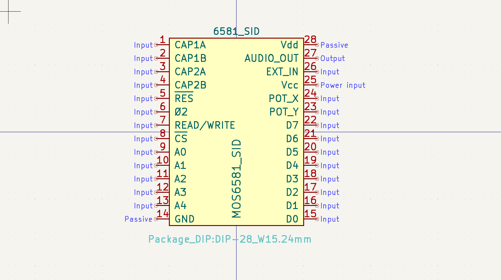

#### General
- Commodore C64
- Commodore C128

One of the most famous 8-bit sound chips. Many DIY and commercial synthesizer projects are builded around this chip.

#### Links/Sources
- [Wikipedia](https://en.wikipedia.org/wiki/MOS_Technology_6581)
- [MIDIbox SID V2](http://www.ucapps.de/index.html?page=midibox_sid.html)
- [Elektron SIDStation](https://www.elektron.se/en/legacy)

### [MOS 8360 (TED)](MOS8360_TED)

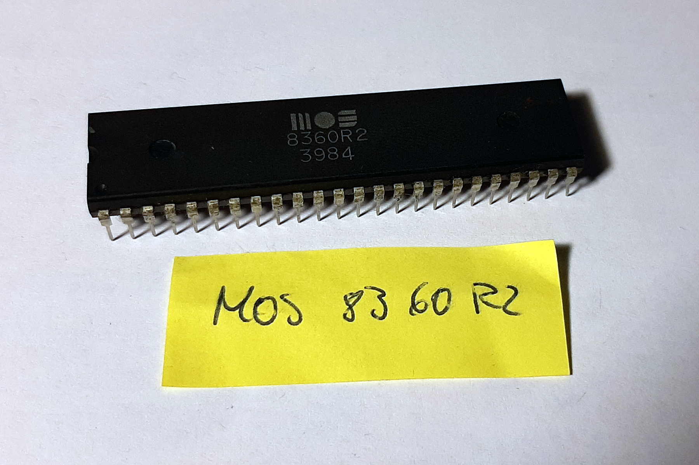

#### General
- Commodore C16
- Commodore C116
- Commodore Plus/4

#### Links/Sources
- [Wikipedia](https://en.wikipedia.org/wiki/MOS_Technology_TED)

### [MOS 8364 (PAULA)](MOS8364_PAULA)

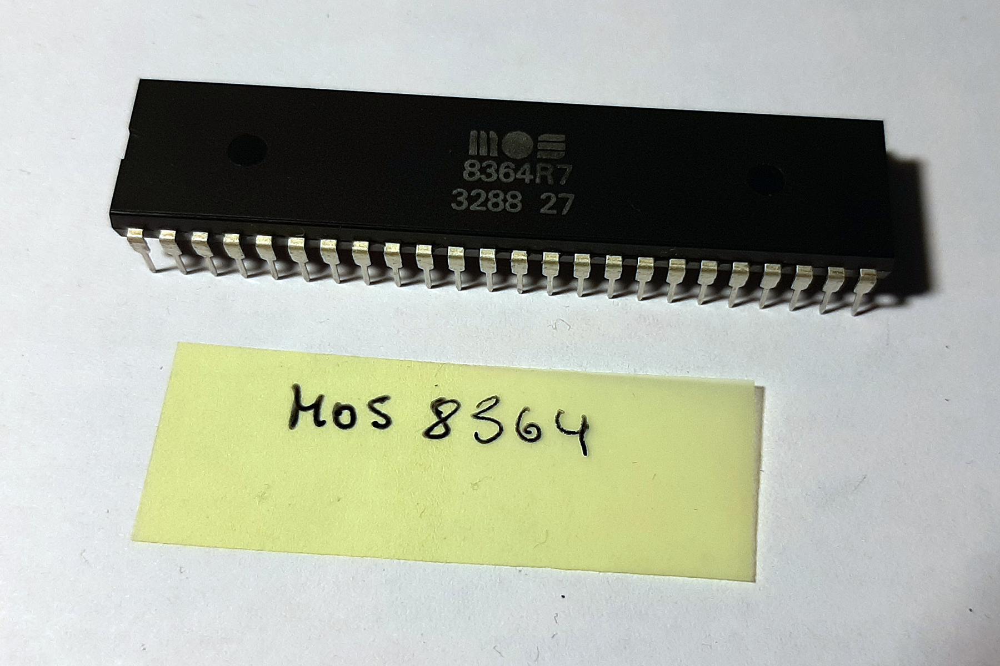

#### General
- Commodore Amiga 500/1000/2000/CDTV

#### Links/Sources
- [Wikipedia](https://en.wikipedia.org/wiki/Original_Chip_Set#Paula)

### [SAA1099](SAA1099)

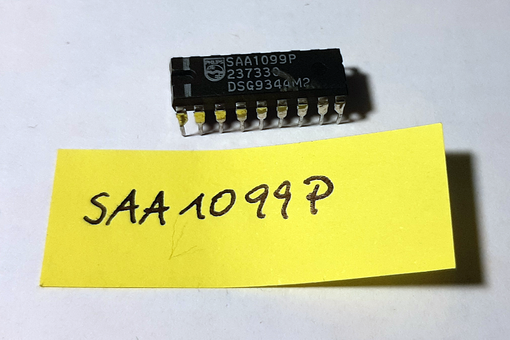

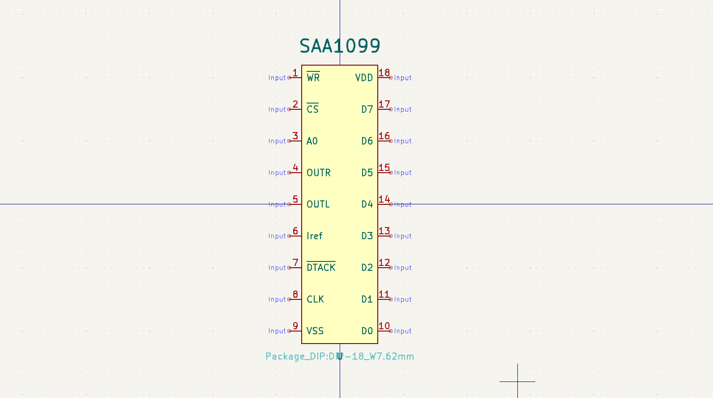

#### General
- Soundblaster 1.0
- SAM Coupé
- some Silicon Graphics boards

#### Links/Sources
- [Wikipedia](https://en.wikipedia.org/wiki/Philips_SAA1099)

### [SN76489](SN76489)

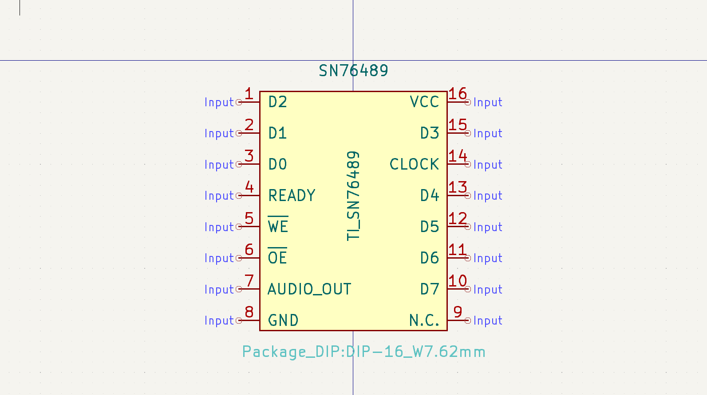

#### General
- TI 99/4A
- ColecoVision
- BBC Micro
- Tandy 1000
- Sega SG-1000 

Clones where integrated in the vedio display processor of

- Sega Master System/Game Gear/Genesis

Other names: SN76496N

#### Links/Sources
- [Wikipedia](https://en.wikipedia.org/wiki/Texas_Instruments_SN76489)

### [SP0256A-AL2](SP0256A-AL2)

#### General
Speech synthesis, avalaible as cartridge for

- Commodore VC20
- Atari 8-bit family
- TRS-80

DIL-28

#### Links/Sources
- [Wikipedia](https://en.wikipedia.org/wiki/General_Instrument_SP0256)

### [YM2151](YM2151)

#### General

- Arcade systems (Sega, Konami, Capcom, ...)

#### Links/Sources
- [Wikipedia](https://en.wikipedia.org/wiki/Yamaha_YM2151)

### [YM2203](YM2203)

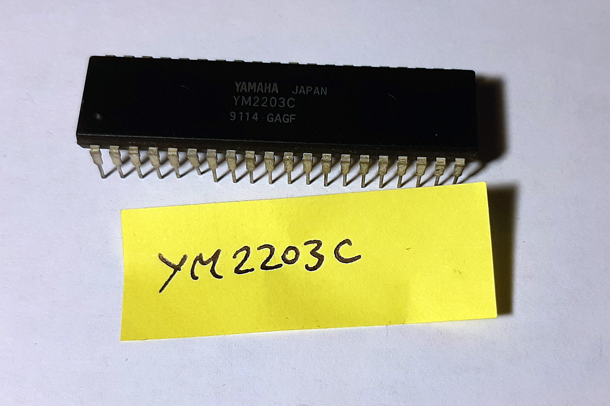

#### General
- Arcade systems

#### Links/Sources
- [Wikipedia](https://en.wikipedia.org/wiki/Yamaha_YM2203)

### [YM2413](YM2413)

#### General
FM synthesis

- Arcade systems (Sega, SNK, Atari, ...)
- Keyboards

#### Links/Sources
- [Wikipedia](https://en.wikipedia.org/wiki/Yamaha_OPL#OPL2)

### [YM2610](YM2610)

#### General
- SNK Neo Geo

#### Links/Sources
- [Wikipedia](https://en.wikipedia.org/wiki/Yamaha_YM2610)

## [YM3812](YM3812)

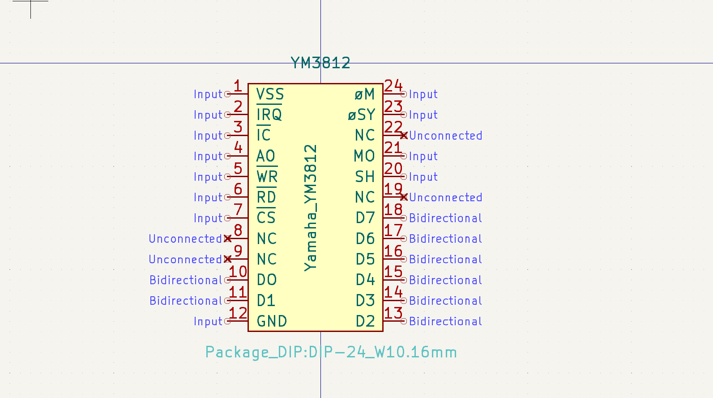

#### General
FM synthesis

- Synthesizers

#### Links/Sources
- [Wikipedia](https://en.wikipedia.org/wiki/Yamaha_OPL#OPL2)
