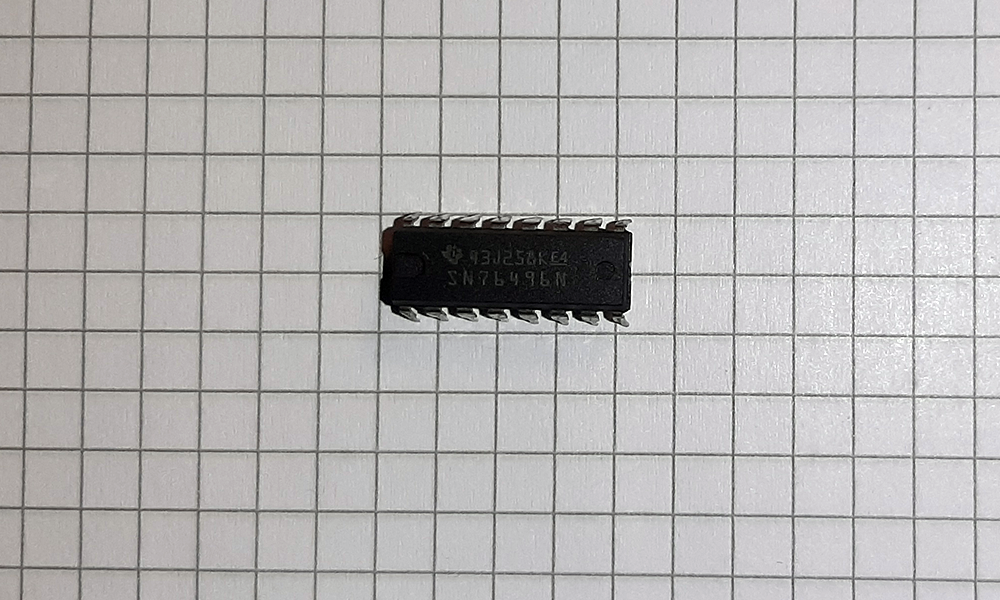

# SN76489

## General
- TI 99/4A
- ColecoVision
- BBC Micro
- Tandy 1000
- Sega SG-1000 

Clones where integrated in the video display processor of

- Sega Master System/Game Gear/Genesis

Other versions: SN76496N (with Audio-In)

## Links/Sources
- [Wikipedia](https://en.wikipedia.org/wiki/Texas_Instruments_SN76489)
