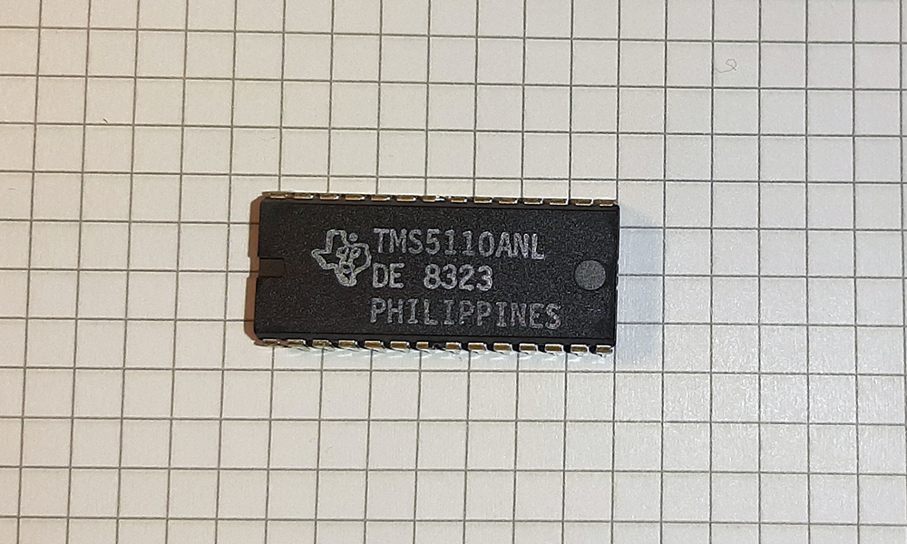
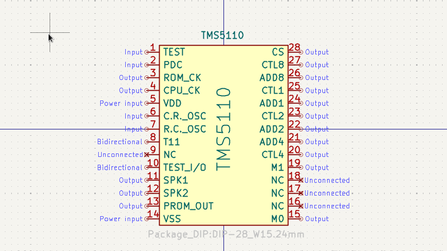

# TMS5110

## General

	

Pin compatible to TMS5110

## Links/Sources

- [Wikipedia about TI LPC Sppech Chips](https://en.wikipedia.org/wiki/Texas_Instruments_LPC_Speech_Chips)
- [Speech synthesizer investigations](https://hackaday.io/project/191735-finding-the-hidden-speak-spell-in-a-renault-25/log/221276-speech-synthesizer-investigations)